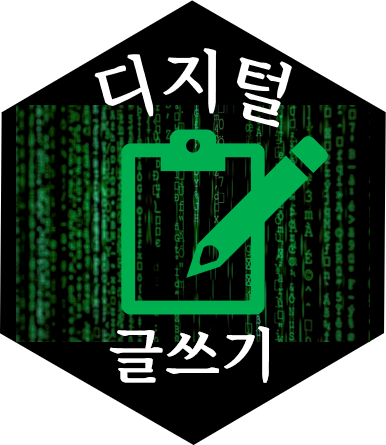

# 디지털 글쓰기

먼저 디지털 글쓰기를 쉽게 누구나 시작할 수 있습니다.
비밀은 마크다운 형식으로 글을 쓰며, R/파이썬 코드를 실행할 수 있고 수학도 가능합니다.

- *이탤릭* and _이탤릭_
- **굵게** and __굵게__
- ***이탤릭 굵게.*** and ___이탤릭 굵게.___
- ~~줄긋기~~

# 아주 큰제목

## 중간제목

### 그 다음 큰 제목

# 표

|변수1|칼럼2|열3|
|------|-----|---|
| 값1  | 값2 |값3|
| 값1  | 값2 |값3|
| 값1  | 값2 |값3|

# 이미지도 넣을 수가 있어요

