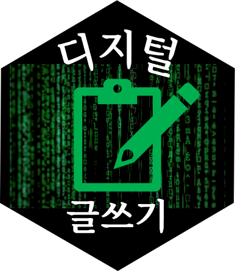

<script id="MathJax-script" async src="https://cdn.jsdelivr.net/npm/mathjax@3/es5/tex-mml-chtml.js"></script>


# 디지털 글쓰기

먼저 디지털 글쓰기를 쉽게 누구나 시작할 수 있습니다.
비밀은 마크다운 형식으로 글을 쓰며, R/파이썬 코드를 실행할 수 있고 수학도 가능합니다.

# 제목

줄에 숫자 기호(`#`)를 한개부터 여섯개까지 작성해서 텍스트에 작성되는 구분 수준이 결정된다.
예를 들어, 다음 문서는 첫번째 큰 제목 두개(`들어가며`, `방법론`)를 갖고, `방법론` 제목에 중첩된 두번째 제목을 갖는다: `인구 추세`

```
# 들어가며
# 방법론
## 인구추세
```

# 텍스트 서식

마크다운으로 쉽게 *이탤릭*, **굵게**, ***이탤릭 굵게*** 글씨체를 지정할 수 있다.
글꼴에 서식 적용은 `*` 혹은 `_`을 사용해서 적용한다. 

```
*이탤릭* and _이탤릭_
**굵게** and __굵게__
***이탤릭 굵게.*** and ___이탤릭 굵게.___
```

글쓰기에서 강조나 이목을 끌기 위해 서식을 달리하여 작성한 마크다운 구문은 다음과 같고 매우 직관적이다.

- *이탤릭* and _이탤릭_
- **굵게** and __굵게__
- ***이탤릭 굵게.*** and ___이탤릭 굵게.___
- ~~줄긋기~~


# 코드

코드는 백틱으로 텍스트를 감싸 *인라인(inline)* 으로 작성하거나,

```
`make` 명령어를 사용해서 작업을 자동화합니다.
```

혹은 백틱 3개나 틸드(`~`) 3개를 한줄씩 코드상하에 넣어 코드블록을 구분한다:


```{r eval = FALSE}
이것이
R, 파이썬
코드블록 입니다.
```

# 링크

하이퍼링크를 작성하는 방식은 두가지가 있다.
첫번째는 *인라인* 으로 작성하는 것으로 `[텍스트](http://link.tld)` 방식을 사용한다.
두번째는 명칭을 지정한 표식을 사용하는 방식이다. 예를 들어:

```{r eval = FALSE}
이것은 [첫번째 링크], 다음은 또다른 [두번째 링크][link2]
[첫번째 링크]: http://link.1
[두번째 링크]: http://link.2
```

명칭을 지정한 표식을 사용하는 방식에 대한 구문은 `[텍스트][표식]` 이 먼저 나오고 나서,

`[표식]: http://link` 표식링크가 문서 다음에 뒤따라 나온다.
`[표식]`이 없는 경우 `[텍스트]: link` 방식으로 *동작하게* 된다.

# 수식

수식을 `LaTeX` 구문으로 작성할 수 있다.
예를 들어, 아래 코드 덩어리는 적법한 `마크다운` 구문이다:

```
2차 함수의 일반형은 $y(x) = ax^2 + bx +c$ 와 같이 수식으로 나타낼 수 있다.
```

수식만 따로 문서에 다음과 같이 수식을 표현할 수 있다.

$$y(x) = ax^2 + bx +c$$

# 표

마크다운이 갖는 이슈중 하나는 표에 대한 지원이 미약하다는 점이다. 
(하지만, `LaTeX` 구문을 사용하는 것은 가능)
그럼에도 불구하고, 상대적으로 간단한 표를 작성하는 방법은 있다.

```
|  교과목  |    담당자 |     선수 교과목 |
|:---------|:-----------|------------------:|
| 마크다운 | xwMOOC        | 쉘, Git, Makefiles |
```

상기 구문을 적용하면 다음에 나온 표가 작성된다.

|  교과목  |    담당자 |     선수 교과목 |
|:---------|:-----------|------------------:|
| 마크다운 | 한국R사용자회 | 쉘, Git, Makefiles |


# 그림

표기법은 **링크**에 사용된 표기법을 따르지만, 느낌표(`!`)를 앞에 위치시킬 필요가 있다.

예를 들어, 

```

```

상기 구문을 적용하면 다음과 같이 그림이 삽입된다.


다른 방법으로 다음과 같이 그림 삽입 구문을 작성해도 된다.


## 컴파일

디지털 글쓰기 작성원고는 마크다운 자체 파일(확장자는 `md`, `qmd`, `rmd`, ` `mkd`, `.markdown`, `.pandoc`)이다. 마크다운을 뭔가 다른 것으로 변환할 때 대체로 PDF, 마이크로소프트 워드, html 혹은 텍스트 프로세서에서 볼 수 있는 문서형식으로 변환시킬 때 컴파일해서 디지털 글쓰기 최종 저자물을 만들어낸다.

# 마무리

이것이 진정한 **디지털 글쓰기** 입니다. 디지털 글쓰기 없이 더이상의 과학기술 발전은 위험할 수 있습니다.


